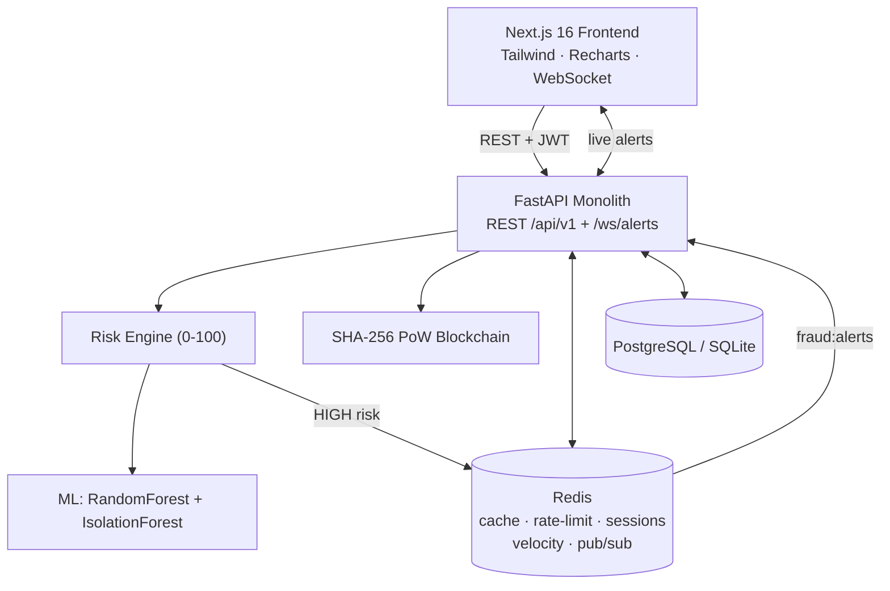

# SecureFlow

**Real-time fraud detection for UPI transactions using Machine Learning, Redis, and a tamper-evident blockchain audit trail.**


SecureFlow scores every UPI payment for fraud in real time, enforces a risk-tiered
response (allow / step-up / block), and writes an immutable audit record to a custom
proof-of-work blockchain. It accompanies the research paper *"SecureFlow: Detecting
Fraudulent Payments in UPI Transactions through Blockchain and Machine Learning Models"*
(IJARES, ISSN 2980-7840).

---

## Architecture



The backend is the single decision authority; the ML model is advisory (heuristic
fallback if unavailable); the blockchain is an append-only audit sink; Redis is a
non-authoritative performance/real-time layer — **every Redis call degrades gracefully**
so the system stays correct (just slower) if Redis is down.

---

## Features

- **ML fraud scoring** — a `RandomForestClassifier` (tuned via 5-fold cross-validated grid
  search) plus an unsupervised `IsolationForest` anomaly detector, trained on 12,000
  synthetic UPI transactions with realistic, independently-generated fraud archetypes
  (account takeover, scam payments, impossible travel, micro-testing). Test AUC-ROC ≈ 0.96.
- **Composite risk engine** — blends the ML signals with velocity, geo-velocity
  (impossible-travel), device-trust, amount-anomaly, and time-of-day into a 0–100 score
  with tiered actions: **LOW → allow**, **MEDIUM → step-up OTP**, **HIGH → block + alert**.
- **Custom blockchain** — genuine SHA-256 proof-of-work chain with genesis block, chain
  validation, tamper detection, and on-disk JSON persistence.
- **Redis everywhere** — prediction & dashboard caching, fixed-window rate limiting,
  session/step-up state, velocity sorted-sets, device sets, geo cache, and a
  `fraud:alerts` pub/sub bus.
- **Risk-based authentication** — logins are themselves scored; unrecognised devices
  trigger step-up OTP verification.
- **Real-time alerts** — WebSocket stream (`/ws/alerts`) bridged to Redis pub/sub.
- **Polished UI** — dark navy fintech dashboard, transaction analysis with a risk gauge
  and feature attributions, a blockchain explorer, and model-performance analytics.
- **UPI Transaction Lab** — a built-in, PhonePe/GPay-style simulator that drives live
  payments through the *real* detection pipeline with a stage-by-stage animation, seven
  one-click attack scenarios, and a Guided Demo mode (see below).
- **Multi-admin consensus governance** — reversing a fraud decision requires **unanimous
  approval from a 4-admin council**, is sealed on-chain, and is protected by an **automatic
  self-healing watchdog** that rolls back any out-of-band tampering from the immutable
  ledger (see below).

---

## 🧪 UPI Transaction Lab

A built-in simulation lab (route **`/lab`**) for demonstrating the fraud pipeline live —
ideal for presentations and interviews. It renders a realistic UPI payment screen in a
phone mockup (with a scannable `upi://pay?…` QR code) and visualises each detection stage
in real time using the backend's **actual per-stage timings**.

> **It's a simulator, not a payment gateway** — no real money moves and no bank APIs are
> called. But every transaction is scored by the *real* RandomForest + IsolationForest
> model, scored by the *real* risk engine, and written to the *real* blockchain. Lab
> transactions also appear in the Dashboard, Blockchain Explorer, and Analytics.

**Features**
- Realistic UPI payment UI with `@bank` autocomplete and live QR generation
- Live pipeline visualizer (Initiated → Validate → Features → ML → Risk → Blockchain → Decision)
- Six demo users seeded with 30 days of history so signals have real context
- Seven preset attack scenarios + a **Guided Demo** that scripts the whole walkthrough
- Real-time stats bar, full session history with per-transaction analysis breakdown, and a one-click reset

**Running a demo** — start the backend + frontend, open `http://localhost:3000/lab`, and
click **Guided Demo** (or run scenarios manually). Demo users are seeded automatically on
backend startup.

**Attack scenarios** — the risk engine is deliberately conservative: a single anomaly
raises a *step-up* challenge, and only overwhelming evidence is hard-*blocked* (minimising
false positives). The presets reflect that:

| Scenario | Description | Result |
|----------|-------------|--------|
| 🟢 Normal Transaction | Regular payment within usual patterns | ✅ Approved |
| 🟡 Unusual High Amount | ~90× the user's average | ⚠️ Step-up Auth |
| 🔴 Impossible Travel | Kolkata on a new device, 2 AM, 5 min after Pune | 🚫 Blocked |
| 🔴 New Device + High Value | Unknown device, large transfer | ⚠️ Step-up Auth |
| 🟡 Midnight Anomaly | ₹25k at 3 AM to a new payee | ⚠️ Step-up Auth |
| 🔴 Account Takeover | New device + new city + high amount + 2:30 AM | 🚫 Blocked (critical) |
| ⚡ Rapid-Fire | 10 escalating txns from a bot device | Escalates ✅ → ⚠️ → 🚫 |

**Screenshots** *(add after deployment)*

| Payment interface | Pipeline mid-process | Attack scenarios | Blocked result |
|---|---|---|---|
| `docs/img/lab-pay.png` | `docs/img/lab-pipeline.png` | `docs/img/lab-scenarios.png` | `docs/img/lab-blocked.png` |

---

## 🏛️ Multi-Admin Consensus Governance

Reversing a transaction's fraud decision (e.g. unblocking a BLOCKED payment) is the most
sensitive admin action — a single compromised admin could quietly wave through fraud. The
governance layer (route **`/governance`**) makes that impossible without collusion, modelled
on how a blockchain is validated by multiple independent nodes.

**How it works**
- **4-admin council, unanimous rule** — an override is a *proposal*, not an instant write.
  It commits only when **all 4 council admins approve**. Any single rejection discards it.
- **Real multi-account approval** — each approval is tied to a separately authenticated
  admin (`admin1…admin4@secureflow.io`, demo password `council123`).
- **Cross-check / divergence detection** — every vote independently attests to the record's
  state hash; if the record changed mid-vote (tampering), the proposal is flagged and discarded.
- **On-chain immutability** — applied overrides are sealed into the proof-of-work chain,
  which is the source of truth.
- **Automatic self-healing watchdog** — a background task continuously re-verifies every
  transaction against the chain. If a rogue admin edits the database directly (bypassing
  consensus), the divergence is **auto-detected and auto-rolled-back from the chain** with a
  live alert — no human action required.
- **Restricted access** — only the council and the main admin can reach the governance area;
  all other accounts are blocked.

**Demo it** — open `http://localhost:3000/governance` (as an admin). Open a proposal, log in
as each council member to approve unanimously; or use the integrity panel to *simulate a
rogue tamper* and watch the watchdog restore it from the chain on its own.

---

## Tech Stack

| Layer       | Technology                                                       |
|-------------|------------------------------------------------------------------|
| Frontend    | Next.js 16, React 19, Tailwind CSS v4, Recharts, lucide-react     |
| Backend     | Python 3.11, FastAPI, Uvicorn, Pydantic v2                        |
| ML          | scikit-learn (RandomForest + IsolationForest), NumPy, pandas      |
| Data        | SQLAlchemy 2.0 + Alembic · PostgreSQL (prod) / SQLite (dev)       |
| Cache / RT  | Redis 7 (redis-py)                                                |
| Blockchain  | Custom Python SHA-256 proof-of-work chain                         |
| Auth        | JWT (PyJWT) + bcrypt                                              |
| Tests       | pytest, httpx, fakeredis (73 tests)                               |

---

## Getting Started

### Prerequisites
- Python 3.11+
- Node.js 18+
- Redis 7 *(optional — the app runs degraded without it)*

### 1. Backend

```bash
cd backend
python -m venv .venv
source .venv/Scripts/activate     # Windows Git Bash;  .venv/bin/activate on macOS/Linux
pip install -r requirements.txt
cp .env.example .env              # then set JWT secrets
python -m app.ml.training         # generates data/fraud_model.joblib (+ metrics)
uvicorn app.main:app --reload --port 8000
```

API docs: http://localhost:8000/docs

### 2. Frontend

```bash
cd frontend
npm install
cp .env.local.example .env.local  # points at http://localhost:8000
npm run dev                       # http://localhost:3000
```

### 3. Or run everything with Docker

```bash
docker compose up --build         # Postgres + Redis + backend + frontend
```

---

## Project Structure

```
secureflow/
├── backend/                 # FastAPI monolith
│   └── app/
│       ├── api/             # routes/ + websockets/
│       ├── core/            # redis_client, blockchain, risk_engine, security
│       ├── ml/              # features, training, evaluation, model
│       ├── models/          # Pydantic schemas
│       ├── config.py · database.py · dependencies.py · main.py
│   └── tests/               # 73 pytest tests
├── frontend/                # Next.js app (Dashboard, Analyze, Blockchain, Analytics, …)
├── legacy/                  # archived pre-rebuild stacks (Express, Hardhat, ai-service)
├── docker-compose.yml · render.yaml
├── ARCHITECTURE.md · AUDIT_REPORT.md
```

---

## How it works

**Blockchain.** Each analysed transaction is sealed into a block: `{index, timestamp,
transactions, previous_hash, nonce, hash}`. Mining brute-forces a nonce until the SHA-256
hash starts with N zeroes (difficulty). `validate_chain()` recomputes every hash and checks
the parent links + proof-of-work; `tamper_detection()` returns the first broken block.

**ML model.** Twelve-plus engineered features (amount z-score, velocity 1h/24h,
geo-distance, impossible-travel, new-device, new-beneficiary, hour/weekend, …) feed a
RandomForest for fraud probability and an IsolationForest for an anomaly score. The model
loads once at startup and predicts in well under 100 ms.

**Risk scoring.** `risk_score = Σ (signal × weight)` over ML probability (40), anomaly (15),
velocity (15), geo (12), new-device (8), amount (6), time (4) → 0–100 → tier → action.

---

## API

`POST /api/v1/transaction/analyze` · `GET /api/v1/transaction/{id}/status` ·
`GET /api/v1/risk-score/{user_id}` · `POST /api/v1/auth/{register,login,verify-step-up,refresh}` ·
`GET /api/v1/blockchain/{chain,validate,stats,block/{i}}` ·
`GET /api/v1/analytics/{dashboard,recent-alerts,model-metrics}` ·
`GET /api/v1/upi/{users,scenarios}` · `POST /api/v1/upi/{pay,scenario/{id},rapid-fire,reset}` ·
`GET /api/v1/upi/{user/{vpa}/history,pipeline-status/{txn}}` ·
`GET /api/v1/governance/{council,proposals,watchdog}` ·
`POST /api/v1/governance/{proposals,proposals/{id}/vote,integrity/{txn}/rollback,integrity/{txn}/simulate-tamper,watchdog/scan}` ·
`GET /api/v1/health` · `WS /ws/alerts`

Full interactive spec at `/docs` (Swagger) and `/redoc`.

---

## Tests

```bash
cd backend && pytest -q          # 73 tests: blockchain, ML, redis, risk engine, API, WebSocket, UPI Lab, Governance
```

---

## Deployment

- **Backend → Render**: the included `render.yaml` provisions the web service, a managed
  Redis, and Postgres. Set `CORS_ORIGINS` to your frontend URL.
- **Frontend → Vercel**: import the `frontend/` directory; set `NEXT_PUBLIC_API_URL` and
  `NEXT_PUBLIC_WS_URL` to the deployed backend.

---

## Research paper

Detailed in *"SecureFlow: Detecting Fraudulent Payments in UPI Transactions through
Blockchain and Machine Learning Models"*, International Journal of Aquatic Research and
Environmental Studies (ISSN: 2980-7840).

## License

MIT
